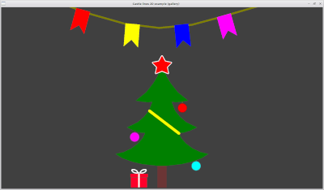
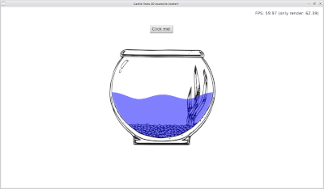
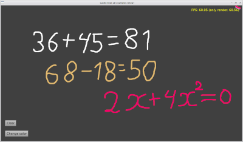
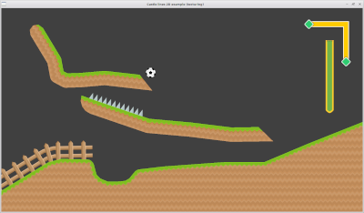

[English language](README.md)

**Castle Lines 2D** это набор из двух компонентов для **Castle Game Engine** ([https://castle-engine.io/](https://castle-engine.io/)).

**Castle Lines 2D** дает возможность создание геометрии из полигонов непосредственно в редакторе CGE.

**Castle Lines 2D** состоит из потомков TCastleAbstractPrimitive:

TCastleLine2D - полилиния.

TCastlePolygon2D - потенциально невыпуклый многоугольник.

Для входа в режим редактирования используйте выпадающие меню в окне иерархии объектов.

**Левая кнопка мыши** - добавить точку, переместить точку.

**Правая кнопка мыши** - удалить точку.

**Средняя кнопка мыши** - вызвать окно для редактирования точки.

Инструкция по подключению компонентов:
--------------------------------------

1.  Скачайте код TCastleLine2D.
2.  Укажите исходный код `TCastleLine2D` в параметрах вашего проекта. Например добавьте это в `CastleEngineManifest.xml:`

            <compiler_options>
              <search_paths>
                <path value="code/" />
                <path value="../../../CastleLines2D/src/" />
              </search_paths>
            </compiler_options>

3.  Также добавьте в `CastleEngineManifest.xml` строку `editor_units="CastleLine2D,CastlePolygon2D"`.
    Смотрите подробную документацию [CastleEngineManifest.xml](https://castle-engine.io/project_manifest)

4.  Откройте Ваш проект в редакторе CGE и используйте _“Project -> Restart Editor (With Custom Components)”_

5.  В Lasarus не забудьте добавить пусть до исходников в _“Параметры проекта -> Параметры компилятора -> Пути -> Другие модули”_

6.  Не забудьте также добавить `CastleLine2D, CastlePolygon2D` в **uses**, чтобы зарегистрировать компоненты во время выполнения.

Документация
------------

Подробную документацию смотрите на [https://kumurtash.github.io/CastleLines2D-docs/index.html](https://kumurtash.github.io/CastleLines2D-docs/index.html)

Примеры
-------

Примеры использования компонентов смотрите в _/CastleLines2D/examples_

   

Журнал изменений
----------------
**12.01.2023**

Добавлены различные способы наложения текстуры на TCastleLine2D, TCastlePolygon2D.

Клавиша Shift теперь помогает рисовать ровные линии.

В CastlePolygon2D добавлено свойство Area - площадь многоугольника

Исправлены баги.

[Подробнее] (https://kumurtash.github.io/CastleLines2D-docs/ru/index.html#change)

* * *
