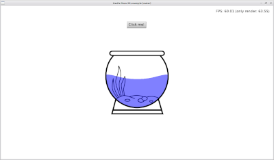
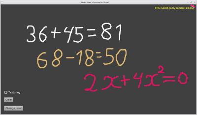

[Русский язык](README.RU.md)

**Castle Lines 2D** is a set of two components for **Castle Game Engine** ([https://castle-engine.io/](https://castle-engine.io/)).

**Castle Lines 2D** makes it possible to create geometry from polygons directly in the CGE editor.

**Castle Lines 2D** consists of classes inherited from TCastleAbstractPrimitive:

TCastleLine2D - polyline.

TCastlePolygon2D - potentially non-convex polygon.

To enter the editing mode, use the drop-down menus in the object hierarchy window

**Left mouse button** - add a point, move a point.

**Right mouse button** - delete a point.

**Middle mouse button** - open a window for editing a point.

Detailed usage instructions:
----------------------------

1.  Get TCastleLine2D code.
2.  Point your project to `TCastleLine2D` sources. E.g. add this to `CastleEngineManifest.xml:`
    
            <compiler_options>
              <search_paths>
                <path value="code/" />
                <path value="../../../CastleLines2D/src/" />
              </search_paths>
            </compiler_options>
          
    
3.  Add to `CastleEngineManifest.xml` the line `editor_units="CastleLine2D,CastlePolygon2D"`.  
    See [CastleEngineManifest.xml](https://castle-engine.io/project_manifest) docs for examples.
    
4.  Open your project in CGE editor and use _“Project -> Restart Editor (With Custom Components)”_
    
5.  In Lazarus don't forget to add the source path to _“Project Options -> Compiler Options -> Paths -> Other unit files”_
    
6.  Be sure to also add `CastleLine2D, CastlePolygon2D` to some uses clause, to register components at runtime.

Documentation
------------

For detailed documentation, see [https://kumurtash.github.io/CastleLines2D-docs/index.html](https://kumurtash.github.io/CastleLines2D-docs/index.html)

Examples
--------

For examples, see _/CastleLines2D/examples_

   

Change log
----------
**12.01.2023**

Added various ways to apply texture to TCastleLine2D, TCastlePolygon2D.

The Shift key now helps to draw straight lines.

In CastlePolygon2D added property - Area

Bugs fixed.

[More details](https://kumurtash.github.io/CastleLines2D-docs/en/index.html#change)

* * *
